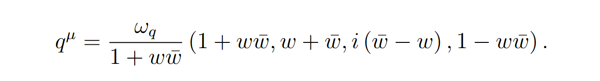
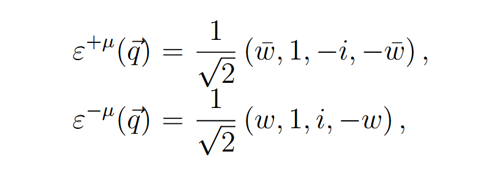

# Note for Celestial

\
(<a href="zotero://select/library/items/J95B9G5E">Pasterski, 2019</a>)

$q^\mu=\frac{\omega_q}{1+w\bar{w}}\left(1+w\bar{w},w+\bar{w},i\left(\bar{w}-w\right),1-w\bar{w}\right).$

\
(<a href="zotero://select/library/items/J95B9G5E">Pasterski, 2019</a>)
