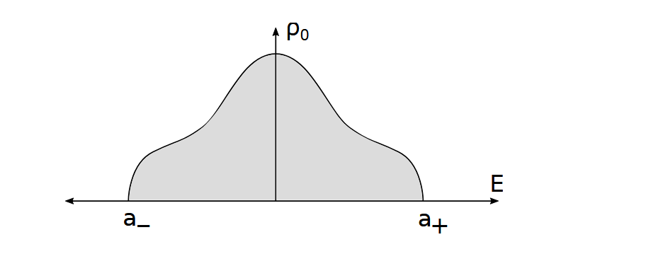
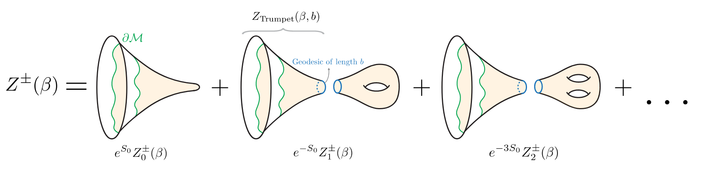
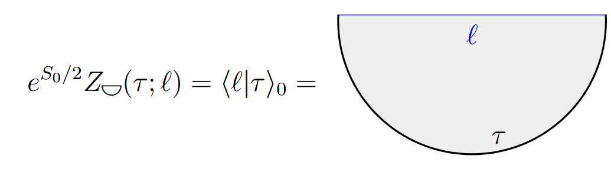
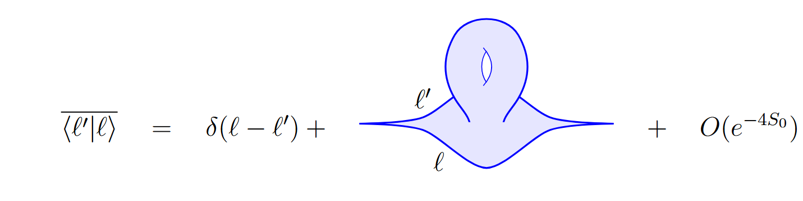
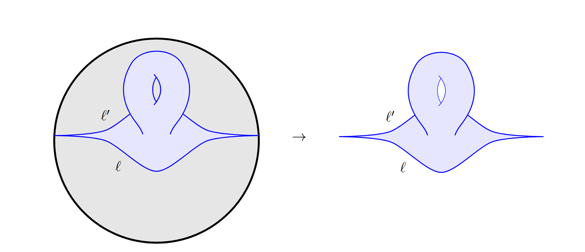
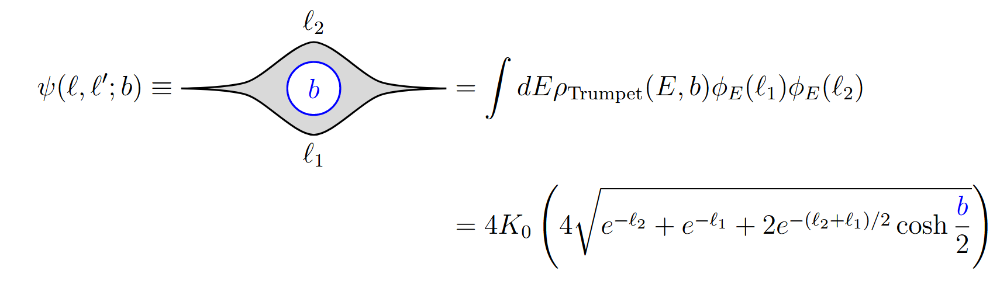
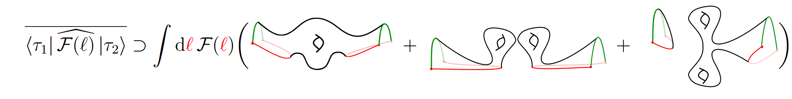

# Note for Matrix Model

所谓矩阵模型便是物理自由度被表示为矩阵这种数学对象的特殊结构

我们很难找到信念以外的理由去确认某个系统的某个自由度一定是由矩阵来表示的，但是我们可以近似的提取出矩阵的结构，将眼光限制在这个矩阵的运算中。

量子原理下的路径积分推导依然成立，但是一般的矩阵模型无法求解

我们一般考虑矩阵模型的几个结构：矩阵积分，配分函数，态密度与解子

我们将H看作一个 matrix sector的场，并且用对称性将他的自由度消减到L，本征值标记为($\lambda_{1 \rightarrow L}$)，理论实际上是相互作用有着矩阵结构的L的场的理论，所以自然的要求

$\braket{H_{ij}H_{kl}}=\frac{1}{L}\delta_{il}\delta_{jk}$

其路径积分即

矩阵积分

$\mathcal{Z}=\int dHe^{-L\operatorname{Tr}V(H)}$

为了简化问题，我们只专注于计算一种类型的简单的关联函数： $\braket{\operatorname{Tr}(H^{k_1})\cdots\operatorname{Tr}(H^{k_m})}$

我们可以将这种类型的关联函数通过系数$\beta$组成生成函数 $Z(\beta_1\cdots \beta_m)=\braket{\operatorname{Tr}e^{-\beta_1 H}\cdots\operatorname{Tr}e^{-\beta_m H}}$ 其中$\beta$的各阶系数就是对应的关联函数

单点下： $Z(\beta)=\braket{\operatorname{Tr}e^{-\beta H}}=\int_{-\infty}^{+\infty} dE e^{-\beta E}\braket{\operatorname{Tr}\delta(E-H)}$ 可以被解释为有能级简并下的正则系综的配分函数，其中E是类似于能量的角色

态密度 $\rho=\braket{\operatorname{Tr}\delta(E-H)}$

解子 resolvent

$R=\braket{\operatorname{Tr}\frac{1}{E-H}}$

满足： $R(E)= \int_{-\infty}^{+\infty} d E ^\prime \frac{\rho(E ^\prime)}{E- E ^\prime}=-\int_0^{+\infty} d\beta\ e^{\beta E}Z(\beta)$

$Z(\beta)=\int_{-\infty}^{+\infty} dE e^{-\beta E}\braket{\operatorname{Tr}\delta(E-H)}= \oint dE e^{-\beta E}\int_{-\infty}^{+\infty} d E ^\prime \frac{\rho(E ^\prime)}{E- E ^\prime}=\oint dE e^{-\beta E}R(E)$

由$\frac1{x+\mathrm{i}\varepsilon}=\mathcal{P}\frac1x-\mathrm{i}\pi\delta(x)$ 这直接给出关系式：$2 i\operatorname{Im}R(E+i\epsilon) =R(E+i\epsilon)-R(E-i\epsilon)=-2\pi i\rho(E)$

上面所用等式来自这么一个等式：$\delta\left(x\right)=\frac1\pi\frac\varepsilon{x^2+\varepsilon^2}$

$R_{n}(E_1\cdots E_n)=\langle \hat R(E_1)...\hat R(E_n)\rangle_{\mathrm{conn.}}\simeq\sum_{g=0}^\infty\frac{R_{g,n}(E_1,...,E_n)}{L^{2g+n-2}}.$

显然的这些解子，生成函数与态密度的关系式在高点高亏格下一一对应成立

特别的，$\rho_{0,1}(E)=-\frac1{2\pi i}\left(R_{0,1}(E+i\epsilon)-R_{0,1}(E-i\epsilon)\right).$

$\rho_{0,1}(E)=\lim_{L\to\infty}\frac1L\rho(E),\ R_{0,1}(E)=\lim_{L\to\infty}\frac1L R(E)$

对于GUE系综，

$\mathcal{Z}=\int d^{L}\lambda\prod_{i<j}(\lambda_{i}-\lambda_{j})^2e^{-L\sum_{j=1}^{L}V(\lambda_{j})}$

$V_{\mathrm{eff}}(\lambda_j)=LV(\lambda_j)-\sum_{i\neq j}\log\left[(\lambda_i-\lambda_j)^2\right]$

鞍点近似：

$V_{\mathrm{eff}}^{\prime}(E)=0\quad\Longrightarrow\quad V^{\prime}(E)=2\int d\lambda\frac{\rho_0(\lambda)}{E-\lambda}=2 \operatorname{Re} R(E)$

$R_{0,1}(E+i\epsilon)+R_{0,1}(E-i\epsilon)=V^{\prime}(E)$

$y=R_{0,1}(E)-\frac{V^\prime(E)}2$ $\begin{aligned}R_{0,1}(E) & =\oint_{E}\frac{d\lambda}{2\pi i}\frac{R_{0,1}(\lambda)}{\lambda-E}\sqrt{\frac{\sigma(E)}{\sigma(\lambda)}}=-\int_{\mathcal{C}}\frac{d\lambda}{2\pi i}\frac{R_{0,1}(\lambda)}{\lambda-E}\sqrt{\frac{\sigma(E)}{\sigma(\lambda)}}\\ & =-\frac12\int_{\mathcal{C}}\frac{d\lambda}{2\pi i}\frac{V^{\prime}(\lambda)}{\lambda-E}\sqrt{\frac{\sigma(E)}{\sigma(\lambda)}}\end{aligned}$

其中：$\sigma(x)=(x-a_{+})(x-a_{-})$

\
(<a href="zotero://select/library/items/VSZ6DLDQ">Saad 等, 2019</a>)

BF理论:

$$
\begin{aligned}\frac12\int\sqrt{g}\phi(R+2)& \to\int\left[\phi(d\omega+e^1\wedge e^2)+\phi_a(de^a+\epsilon^{a}_b\omega\wedge e^b)\right]\\
&=i\int\text{Tr}(BF).
\end{aligned}
$$

模空间:

$$
\mathrm{Mod}(\Sigma_{g})\equiv\mathcal{M}_g/\mathrm{Diff}(\Sigma_{g})\quad\mathrm{Teich}(\Sigma_{g})\equiv\mathcal{M}_{g}/\mathrm{Diff}_0(\Sigma_{g}).
$$

$$
\int\mathrm{d}^n\tau\frac{|\det(\mu,\phi)|^2}{\det(\phi,\phi)}=\int\mathrm{d}(\text{Weil-Petersson})
$$

$$
\Omega=\alpha\sum_{i=1}^{3g+n-3}d\widetilde{b}_i\wedge d\tau_i,

$$

$$
\int_\tau\Omega=\alpha db\int_0^bd\tau=\alpha bdb
$$

SJT模型：（$L=e^{S_0}$）

$$
ds^2=\sinh^2(r)d\tau^2+dr^2,\quad\quad\tau\sim\tau+2\pi,
$$

$$
\begin{aligned}Z_{g,1}(\beta)&=\alpha\int_0^\infty bdbV_{g,n}^\alpha(b)Z_{\text{Sch}}^{\text{trumpet}} ( \beta , b ) \end{aligned}

$$

例如：

$$
\begin{aligned}
Z_{0,2}(\beta_1,\beta_2)& \begin{aligned}&=\int_0^\infty bdb\left(\frac{\gamma^{1/2}}{(2\pi)^{1/2}\beta_1^{1/2}}e^{-\frac{\gamma}{2}\frac{b^2}{\beta_1}}\right)\left(\frac{\gamma^{1/2}}{(2\pi)^{1/2}\beta_2^{1/2}}e^{-\frac{\gamma}{2}\frac{b^2}{\beta_2}}\right)\end{aligned}  \\
&=\frac{\sqrt{\beta_1\beta_2}}{2\pi(\beta_1+\beta_2)}
\end{aligned}
$$

$$
\begin{aligned}W_{g,n}(z_1,...,z_n)&=\int_0^\infty b_1db_1e^{-b_1z_1}...\int_0^\infty b_ndb_ne^{-b_nz_n}V_{g,n}(b_1,...,b_n)\end{aligned}
$$

$$
Z_{\mathrm{Disk}}(\beta)=e^{S_0}Z_{\mathrm{SJT},0,1}(\beta)=e^{S_0}\sqrt{\frac2{\pi\beta}}e^{\pi^2/\beta}
$$

$$
\begin{aligned}Z_{\text{SJT},0,1}(\beta) & =\int_0^{\infty}dE\ \rho_{\text{SJT},0,1}(E)e^{-\beta E}\quad\Rightarrow\quad\rho_{\text{SJT},0}(E)=\frac{\sqrt{2}\cosh(2\pi\sqrt{E})}{\pi\sqrt{E}}\end{aligned}
$$

能谱从0开始。

$$
Z_{\text{Trumpet}} ( \beta , b ) = \frac 1 { \sqrt { 2 \pi \beta }}e^{-b^2/4\beta}
$$

$$
\begin{aligned}Z_{\text{SJT},g,n}^{\pm}(\beta_1,\ldots,\beta_{n}) & =\left[\prod_{i=1}^{n}\int_0^{\infty}db_{i}b_{i}Z_{\text{Trumpet}}(\beta_{i},b_{i})\right]V_{g,n}^{\pm}(b_1,\ldots,b_{n})\end{aligned}
$$

\
(<a href="zotero://select/library/items/V8WPKK2N">Rosso 和 Turiaci, 2022</a>)

递推公式：

LOOP eq：

$$
\begin{aligned}0&=\int_{-\infty}^\infty\mathrm{d}^L\lambda\frac{\partial}{\partial\lambda_a}\left[\frac{1}{x-\lambda_a}\hat R(I)\prod_{i<j}|\lambda_i-\lambda_j|^\beta\prod_ie^{-L\frac{\beta}{2}V(\lambda_i)}\right]\end{aligned}
$$

$$
0=\left\langle\left[\frac1{(x-\lambda_a)^2}+\beta\frac1{x-\lambda_a}\sum_{j\neq a}\frac1{\lambda_a-\lambda_j}-\frac{L\beta}2\frac{V^{\prime}(\lambda_a)}{x-\lambda_a}\right]\hat R(I)+\frac1{x-\lambda_a}\partial_{\lambda_a}\hat R(I)\right\rangle 
$$

$$
\begin{aligned}\frac1{x-\lambda_a}\frac1{\lambda_a-\lambda_j} & \to\frac12\left(\frac1{x-\lambda_a}\frac1{\lambda_a-\lambda_j}+\frac1{x-\lambda_j}\frac1{\lambda_j-\lambda_a}\right)\\  & =\frac12\frac1{x-\lambda_a}\frac1{x-\lambda_j}\end{aligned}
$$

$$
\begin{aligned}
\begin{aligned}\sum_a\frac{1}{(x-\lambda_a)^2}+\frac{\beta}{2}\sum_{a,j\neq a}\frac{1}{x-\lambda_a}\frac{1}{x-\lambda_j}\end{aligned}& \begin{aligned}=\sum_a\frac{1-\frac{\beta}{2}}{(x-\lambda_a)^2}+\frac{\beta}{2}\sum_{a,j}\frac{1}{x-\lambda_a}\frac{1}{x-\lambda_j}\end{aligned}  \\
&=-(1-\frac\beta2)\partial_x\hat R(x)+\frac\beta2\hat R(x,x).
\end{aligned}
$$

$$
\sum_a\frac{V^{\prime}(\lambda_a)}{x-\lambda_a}\hat R(I)=V^{\prime}(x)\hat R(x,I)-\sum_a\frac{V'(x)-V'(\lambda_a)}{x-\lambda_a}\hat R(I)
$$

$$
\begin{aligned}\partial_{\lambda_a}\hat R(I)=\sum_{k=1}^n\frac1{(x_k-\lambda_a)^2}\hat R(I\setminus x_k)\end{aligned},\ \frac1{(x-\lambda_a)(x_k-\lambda_a)^2}=\partial_{x_k}\frac{\frac1{x-\lambda_a}-\frac1{x_k-\lambda_a}}{x-x_k}
$$

$$
\begin{aligned}\sum_{a=1}^{L}\frac{1}{x-\lambda_a}\partial_{\lambda_a}\hat R(I)&=\sum_{k=1}^{n}\partial_{x_k}\frac{\hat R(x,I\setminus x_k)-\hat R(I)}{x-x_k}\end{aligned}
$$

$$
\begin{aligned}\left<(1-\frac{2}{\beta})\partial_{x}\hat R(x,I)+\hat R(x,x,I)-LV^{\prime}(x)\hat R(x,I)+\frac{2}{\beta}\sum_{k=1}^{n}\partial_{x_{k}}\frac{\hat R(x,I\setminus x_k)-\hat R(I)}{x-x_k}\right>\\=-L\left<\sum_a\frac{V'(x)-V'(\lambda_a)}{x-\lambda_a}\hat R(I)\right>\end{aligned}
$$

$$
V_{0,2}^{\pm}(b_1,b_2)=2\delta(b_1-b_2)/b_1
$$

$$
\begin{aligned}V_{g=1,n}^-(b_1,\ldots,b_n)&=\frac12\frac{(-1)^n(n-1)!}{4},\\V_{g=2,n}^-(b_1,\ldots,b_n)&=3\frac{(-1)^n(n+1)!}{4^5}\left[(2\pi)^2(n+2)+\sum_{i=1}^nb_i^2\right],\end{aligned}
$$

$$
\begin{aligned}V_{g=3,n}^{-}(b_1,\cdots,b_n)=\frac{1}{5}\frac{(-1)^{n}(n+3)!}{4^9}\left[(2\pi)^4(n+4)(42n+185)+84(2\pi)^2(n+4)\sum_{i=1}^nb_i^2+
+25\sum_{i=1}^n b_i^4+84\sum_{i \neq j}^n b_i^2b_j^2\right].\end{aligned}
$$

简化的一种矩阵模型：

IP model: （对偶于什么？）

可以理解为坐标为X的本征值的N个粒子于一个用来探测理论的复的N矢量的$\phi$场相互作用，

$$
H=\frac12\operatorname{Tr}(\Pi^2)+\frac{m^2}2\operatorname{Tr}(X^2)+\pi^\dagger(1+gX/M)\pi+M^2\phi^\dagger(1+gX/M)\phi.
$$

$$
a_i=\frac{\pi_i^\dagger-iM\phi_i}{\sqrt{2M}},\quad\bar{a}_i=\frac{\pi_i-iM\phi_i^\dagger}{\sqrt{2M}}
$$

$$
H=\frac{1}{2}{\rm{Tr}}(\Pi^2)+\frac{m^2}2\operatorname{Tr}(X^2)+M(a^\dagger a+\bar{a}^\dagger\bar{a})+g(a^\dagger Xa+\bar{a}^\dagger X^T\bar{a})
$$

$$
S_{\mathrm{Liouvile}}=\frac1{48\pi}\int_{\mathrm{M}}\mathrm{d}^2\xi\sqrt{\hat{g}}\left(\frac12\hat{g}^{ab}\partial_{a}\sigma\partial_{b}\sigma+\mu^2(\mathrm{e}^{\sigma}-1)-\frac12\sigma\right).
$$

pants分解：

$\begin{aligned}S&=-\frac12\int_0^\beta\mathrm{d}t\left[\left\{\tan\left(\frac y2\right),t\right\}+2(\partial_t\sigma)^2\right]=-\frac{\pi^2}\beta-\frac{\widehat{q}^2}\beta\alpha^2.\end{aligned}$ $Z_{1\text{-Loop, D}} ^\text{Rep.}{ = }\prod_{m\geq2}\frac{2\beta}m=\frac1{4\sqrt{\pi}\beta^{3/2}}.$

### JT引力为何与随机矩阵对偶

纯引力：

$$
\begin{aligned}\mathcal{H}_0\simeq L^2(\mathbb{R}),\quad|\psi\rangle=\int d\ell\psi(\ell)|\ell\rangle,\quad\langle\psi|\psi\rangle_0=\int|\psi(\ell)|^2d\ell\quad(S_0\rightarrow\infty)\end{aligned}
$$

$$
H=H_L=H_R=-\frac12\partial_\ell^2+2e^{-\ell}.
$$

$$
|\psi\rangle=\int d\ell\psi(\ell)|\ell\rangle,\ \  \phi_E(\ell)=\langle\ell|E\rangle_0=4K_{i\sqrt{8E}}\left(4e^{-\ell/2}\right)
$$

$$
\begin{aligned}\langle E'|E\rangle_0&=\frac{\delta(E-E')}{\rho_0(E)},\quad\int_0^\infty dE\rho_0(E)|E\rangle\langle E|=1_0\end{aligned}
$$

$$
\rho_0(E)=\frac1{4\pi^2}\sinh\left(2\pi\sqrt{2E}\right)
$$

$$
\left<\psi|\psi\right>=e^{-S_0}\sum_i\left|\int\phi_{E_i}(\ell)\psi(\ell)d\ell\right|^2,\langle\ell|\ell^{\prime}\rangle=e^{-S_0}\sum_i\phi_{E_i}(\ell)\phi_{E_i}(\ell^{\prime}).
$$

$$
|\tau\rangle=e^{S_0/2}\int dE\left.\rho_0(E)e^{-\tau E}|E\right\rangle 
$$

$$
\begin{aligned}|\tau\rangle&=e^{S_0/2}\int d\ell\  Z_{\text{semi-disk}}(\tau;\ell)|\ell\rangle,\\Z_{\text{semi-disk}}(\tau;\ell)&=\int dE\ \rho_0(E)e^{-\tau E}\phi_{E}(\ell).\end{aligned}
$$

\
(<a href="zotero://select/library/items/ZNJG7BGH">Iliesiu 等, 2024</a>)

\
(<a href="zotero://select/library/items/ZNJG7BGH">Iliesiu 等, 2024</a>)

$$
\begin{aligned}Z(\tau+\tau')&=e^{S_0}\int d\ell d\ell'Z_{\text{semi-disk}}(\tau;\ell)Z_{\text{semi-disk}}(\tau';\ell')\langle\ell'|\ell\rangle.\end{aligned}
$$

\
(<a href="zotero://select/library/items/ZNJG7BGH">Iliesiu 等, 2024</a>)

$$
\begin{aligned}\sum_{i=0}^\infty e^{-(\tau+\tau^{\prime})E_i}&=e^{S_0}\int d\ell d\ell^{\prime}dE\rho_0(E)dE^{\prime}\rho_0(E^{\prime})e^{-(\tau E+\tau^{\prime}E^{\prime})}\phi_E(\ell)\phi_{E^{\prime}}(\ell^{\prime})\langle\ell^{\prime}|\ell\rangle\end{aligned}
$$

$$
\begin{aligned}\sum_{i=0}^\infty\delta(E-E_i)\delta(E^{\prime}-E_i)&=e^{S_0}\rho_0(E)\rho_0(E^{\prime})\int d\ell d\ell^{\prime}\phi_E(\ell)\phi_{E^{\prime}}(\ell^{\prime})\langle\ell^{\prime}|\ell\rangle\end{aligned}
$$

$$
\begin{aligned}\int dE\rho_0(E)\phi_E(\ell)\phi_E(\ell')=\delta(\ell-\ell')\end{aligned}
$$

$$
\begin{aligned}\overline{\langle\ell_1^{\prime}|\ell_1\rangle\cdots\langle\ell_n^{\prime}|\ell_n\rangle}_{\mathrm{conn.}}&=e^{(1-2g-n)S_0}\sum_{g=0}^\infty\eta_{n,g}(\ell_1,\ldots,\ell_n;\ell_1^{\prime},\ldots,\ell_n^{\prime})\end{aligned}
$$

\
(<a href="zotero://select/library/items/ZNJG7BGH">Iliesiu 等, 2024</a>)

$$
\begin{aligned}Z_{n,g}(\tau_1+\tau_1',\ldots,\tau_n+\tau_n')&=\int\left(\prod_{k=1}^nd\ell_kd\ell_k'Z_\text{semi-disk}(\tau_k;\ell_k)Z_\text{semi-disk}(\tau_k';\ell_k')\right)\eta_{n,g}(\ell_1,\ldots,\ell_n;\ell_1',\ldots,\ell_n')\end{aligned}
$$

\
(<a href="zotero://select/library/items/ZNJG7BGH">Iliesiu 等, 2024</a>)

$$
\rho_{\text{Trumpet}} ( E , b ) = \frac { \cos \left ( b \sqrt { E }\right)}{\pi\sqrt{E}}
$$

\
(<a href="zotero://select/library/items/ZNJG7BGH">Iliesiu 等, 2024</a>)

$$
\overline{\left<\tau_1\right|\widehat{\mathcal{F}(\ell)}\left|\tau_2\right>}=\int\frac{Dg_{\mu\nu}D\Phi}{\mathrm{Diffs}}\left(\sum_\gamma\mathcal{F}(\ell_\gamma)\right)e^{-I_\mathrm{JT}}
$$
